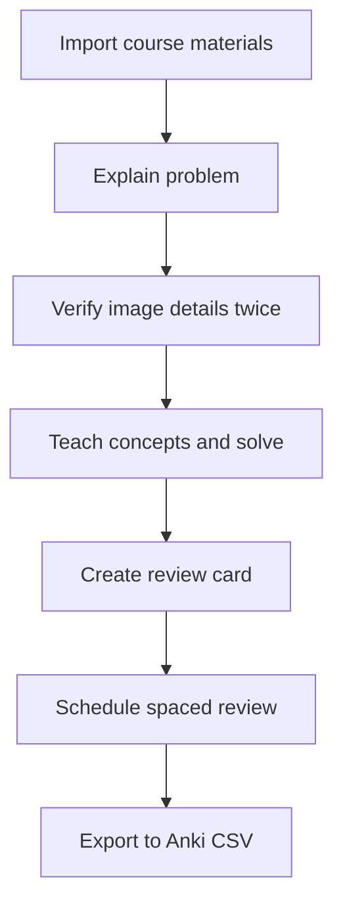

# AI Study Tutor

[Chinese version](README.md)

AI Study Tutor is a local Codex plugin for course-aware problem solving, verified image reading, concise full-credit exam solutions, detailed teaching explanations, review cards, spaced review, and Anki-ready export.

Its goal is not just to produce answers. It works like a careful study tutor: read the problem first, verify image details, teach from the underlying concepts, and turn useful problems into reusable review cards.


## Features

- **Verified image reading**: transcribe image-based questions, then re-check numbers, units, labels, directions, graph scales, circuit polarity, and option text before solving.
- **Two-pass solving**: first provide a concise exam-ready full-credit solution, then provide a detailed step-by-step teaching explanation.
- **Course-aware tutoring**: built-in references for:
  - Electrical Engineering
  - Probability and Mathematical Statistics
  - Complex Functions and Integral Transforms
- **Fixed explanation template**: restate the problem, list knowns and unknowns, teach prerequisites, solve step by step, check the result, and summarize the method.
- **Print-ready document delivery**: deliver solved problems, lecture notes, handouts, and homework solutions as polished PDFs; also provide a formatted DOCX when continued editing may be needed.
- **Page-by-page visual acceptance**: render and inspect every page for formulas, Chinese fonts, images, tables, page breaks, and page numbers instead of treating valid source or a successful compile as final acceptance.
- **Image preprocessing**: enhance blurry or low-contrast screenshots/photos before reading.
- **Review cards**: generate Markdown wrong-question cards and register them in a spaced review queue.
- **Course material import**: import PDF, DOCX, TXT, and Markdown course materials into generated reference notes.
- **Anki export**: export review cards to CSV for Anki import.

## Installation

This repository is a Codex plugin. For local development, place it under your local plugins directory and install it from a configured marketplace.

If using the personal marketplace flow used by this project:

```bash
codex plugin add ai-study-tutor@tarsgo-plugins
```

After installing or updating the plugin, start a new Codex thread so the latest skill instructions and scripts are loaded.

## Usage

Use the skill explicitly:

```text
Use $ai-study-tutor to explain this problem step by step.
```

Or ask naturally:

```text
Explain this problem and first check whether any image details may have been read incorrectly.
```

```text
Solve this electrical engineering problem twice: exam answer first, detailed teaching explanation second.
```

```text
Import this probability lecture note and use it as context for future explanations.
```

```text
What should I review today?
```

## Two-Pass Format

For problem explanations, the plugin solves the same problem twice by default:

### First Pass: Exam Answer

The exam answer is designed to be concise but full-credit. It is written like a solution you could put on a test paper:

1. State the key formula, theorem, or method.
2. Substitute the given values.
3. Keep the necessary calculation steps and units.
4. Give a clear final conclusion.

The exam pass avoids long conceptual explanations. Its purpose is to show what to write during an exam and which scoring steps should not be skipped.

### Second Pass: Teaching Explanation

The teaching explanation is designed to make the reasoning truly understandable, not merely to make the exam answer longer. It slows down and explains:

1. The prerequisite concepts used in the problem.
2. What each symbol in the formulas means.
3. Where the formula comes from, what conditions it requires, and why those conditions hold here.
4. Each algebraic or logical step, without skipping important rearrangements, unit conversions, or sign handling.
5. Why each major step is valid.
6. Helpful diagrams, tables, or analogies when useful.
7. The most likely places to misread, choose the wrong formula, or make a calculation mistake.
8. How to recognize this type of problem next time, what first move to make, and how to check the answer.

This format serves both goals: learning how to earn points on an exam and understanding the principles behind the solution.

## Learning Loop



## Included Skill

The main skill lives at:

```text
skills/ai-study-tutor/SKILL.md
```

It instructs Codex to:

- load the relevant course reference only when useful;
- inspect image questions twice before solving;
- disclose uncertain visual details instead of guessing;
- solve each problem twice by default: exam answer first, teaching explanation second;
- use LaTeX for formulas;
- deliver solved problems, lecture notes, handouts, and homework solutions as directly readable and printable PDFs, with a formatted DOCX when continued editing is likely;
- treat Markdown, LaTeX, HTML, and scripts as internal sources rather than final reading artifacts;
- render and inspect every page for formulas, Chinese fonts, images, tables, page breaks, margins, and page numbers, then fix and re-check any defects;
- verify LaTeX in the rendered artifact so raw commands, missing glyphs, clipping, overflow, or broken alignment never reach the user;
- include tables, Mermaid, ASCII diagrams, or generated images when helpful;
- create review cards and spaced review records when requested.

## Course References

Reference files are in:

```text
skills/ai-study-tutor/references/
```

Current references:

- `electrical-engineering.md`
- `probability-statistics.md`
- `complex-functions-integral-transforms.md`
- `explanation-template.md`
- `review-card-template.md`

Generated course notes from imported materials are written to:

```text
skills/ai-study-tutor/references/generated/
```

## Scripts

### Prepare Problem Image

Enhance a screenshot/photo for easier reading:

```bash
python3 scripts/prepare_problem_image.py ./problem.png --threshold 180
```

The script outputs grayscale, enhanced, and optional black/white copies.

### Import Course Material

Import PDF, DOCX, TXT, or Markdown files into generated course references:

```bash
python3 scripts/import_course_material.py ./lecture.pdf \
  --course "Electrical Engineering" \
  --topic "First-order circuits"
```

PDF import requires `pypdf`; DOCX import requires `python-docx`.

### Make Review Card

Create a Markdown review card:

```bash
python3 scripts/make_review_card.py \
  --title "Basic Ohm's Law Problem" \
  --course "Electrical Engineering" \
  --topic "Ohm's Law" \
  --question "Find the current from voltage and resistance" \
  --method "Identify U and R" \
  --method "Use I=U/R" \
  --formula '$I=U/R$' \
  --mistake "Do not read kilo-ohms as ohms" \
  --memory "Check units before applying Ohm's law" \
  --register
```

With `--register`, the generated card is also added to the spaced review queue.

### Study Progress

List due reviews:

```bash
python3 scripts/study_progress.py due
```

Record a review result:

```bash
python3 scripts/study_progress.py review \
  --id "electrical-engineering--basic-ohm-s-law-problem" \
  --result good
```

Review results:

- `again`
- `hard`
- `good`
- `easy`
- `mastered`

Progress is stored by default at:

```text
~/.ai-study-tutor/progress.json
```

### Export Anki CSV

Export review cards for Anki:

```bash
python3 scripts/export_anki_csv.py --output ./anki-cards.csv
```

The CSV fields are:

- `Front`
- `Back`
- `Tags`

Import the CSV in Anki using the standard file import flow.

## Repository Structure

```text
.
├── .codex-plugin/
│   └── plugin.json
├── assets/
│   ├── icon.png
│   ├── logo.png
│   └── screenshot.png
├── scripts/
│   ├── export_anki_csv.py
│   ├── import_course_material.py
│   ├── make_review_card.py
│   ├── prepare_problem_image.py
│   └── study_progress.py
└── skills/
    └── ai-study-tutor/
        ├── SKILL.md
        ├── agents/
        │   └── openai.yaml
        └── references/
```

## Development

Validate the skill:

```bash
PYTHONPATH=/tmp/codex-skill-validate-pyyaml \
python3 ~/.codex/skills/.system/skill-creator/scripts/quick_validate.py \
  skills/ai-study-tutor
```

Validate the plugin:

```bash
PYTHONPATH=/tmp/codex-skill-validate-pyyaml \
python3 ~/.codex/skills/.system/plugin-creator/scripts/validate_plugin.py .
```

Update the local plugin cachebuster after changes:

```bash
python3 ~/.codex/skills/.system/plugin-creator/scripts/update_plugin_cachebuster.py .
codex plugin add ai-study-tutor@tarsgo-plugins
```

## License

No license has been selected yet. Add one before publishing this repository publicly.
