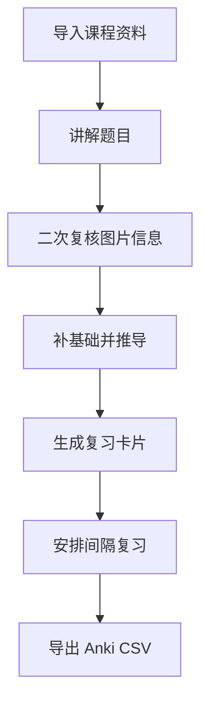

# AI Study Tutor

[英文版](README.en.md)

AI Study Tutor 是一个本地 Codex 插件，用于课程化讲题、图片信息二次复核、考试版满分作答、教学版原理讲解、错题卡片、间隔复习和 Anki 导出。

它的目标不是只给答案，而是像一个谨慎的学习助教：先读题、复核图片信息，再从基础概念讲起，最后把有价值的题整理成可复习的错题卡。


## 功能

- **图片读题二次复核**：先转写图片题中的文字、数字、单位、标签、方向、坐标轴、电路极性和选项，再进行第二轮检查后解题。
- **同题两遍作答**：第一遍给“考试版”，简洁、规范、够拿满分；第二遍给“教学版”，一步一步讲清楚原理。
- **课程化讲解**：内置以下课程参考资料：
  - 电工电子学
  - 概率论与数理统计
  - 复变函数与积分变换
- **固定讲题模板**：复述题目、列出已知量/未知量、补充基础知识、逐步推导、检查答案、总结方法。
- **可打印文档交付**：题目、讲义和作业解答以排版完成的 PDF 作为最终成品；需要继续编辑时同时提供 DOCX。
- **逐页视觉验收**：实际渲染并逐页检查公式、中文字体、图片、表格、分页和页码，不以源码正确或编译通过代替成品检查。
- **图片预处理**：增强模糊、低对比度截图或照片，降低看错题的概率。
- **错题/复习卡片**：生成 Markdown 错题卡，并可登记到间隔复习队列。
- **课程资料导入**：把 PDF、DOCX、TXT、Markdown 课程资料导入为可检索参考笔记。
- **Anki 导出**：把复习卡片导出为 Anki 可导入的 CSV。

## 安装

这个仓库是一个 Codex 插件。用于本地开发时，把它放在本地插件目录中，并通过已配置的 marketplace 安装。

如果使用本项目当前的 personal marketplace 流程：

```bash
codex plugin add ai-study-tutor@tarsgo-plugins
```

安装或更新插件后，建议新开一个 Codex 线程，让最新的 skill 指令和脚本说明被重新加载。

## 使用示例

显式调用 skill：

```text
Use $ai-study-tutor to explain this problem step by step.
```

也可以自然提问：

```text
讲一下这道题，先帮我确认图片里有没有读错。
```

```text
把这道电工电子学题做两遍：第一遍按考试满分过程写，第二遍一步一步讲原理。
```

```text
导入这份概率论课件，以后讲题时参考它。
```

```text
今天我应该复习哪些错题？
```

## 两遍做题格式

讲题时默认同一道题做两遍：

### 第一遍：考试版

考试版的目标是“简洁但满分”。它会尽量像试卷答案一样组织：

1. 写出关键公式、定理或方法。
2. 代入题目给出的已知量。
3. 保留必要的计算步骤和单位。
4. 写出明确结论。

考试版不会展开长篇原理解释，重点是让你知道考试时该怎么写、哪些步骤不能省。

### 第二遍：教学版

教学版的目标是“真正讲懂”，而不是把考试版稍微写长一点。它会放慢速度：

1. 先解释本题用到的基础概念。
2. 定义公式中的每个符号。
3. 说明公式从哪里来、适用条件是什么、为什么本题能用。
4. 一步一步推导、代入、化简，不跳过关键代数步骤、单位换算和正负号处理。
5. 每个关键步骤都解释“为什么可以这样做”。
6. 用图示、表格或类比说明容易卡住的地方。
7. 指出最容易看错、套错或算错的位置。
8. 最后总结这类题的识别方法、第一步该做什么、怎么检查答案。

这种格式适合两种需求同时满足：你既能学会考试怎么拿分，也能理解背后的原理。

## 学习闭环



## 内置 Skill

主 skill 位于：

```text
skills/ai-study-tutor/SKILL.md
```

它会指导 Codex：

- 只在有帮助时加载相关课程参考资料；
- 对图片题先读图、再复核，然后再解题；
- 对不确定的视觉信息明确说明，而不是猜测；
- 默认同一道题做两遍：考试版在前，教学版在后；
- 使用 LaTeX 表示公式；
- 将题目、讲义和作业解答交付为可直接阅读、打印的 PDF，并在用户可能继续编辑时附带排版完成的 DOCX；
- 把 Markdown、LaTeX、HTML 和脚本视为内部源文件，而不是最终阅读成品；
- 实际渲染并逐页检查公式、中文字体、图片、表格、分页、页边距和页码，修复后重新验收；
- 检查 LaTeX 在最终成品中的显示效果，避免原始命令、缺字、截断、溢出或错位；
- 在有帮助时使用表格、Mermaid、ASCII 图或 AI 生图辅助理解；
- 在用户需要时创建复习卡片和间隔复习记录。

## 课程参考资料

参考资料位于：

```text
skills/ai-study-tutor/references/
```

当前包含：

- `electrical-engineering.md`
- `probability-statistics.md`
- `complex-functions-integral-transforms.md`
- `explanation-template.md`
- `review-card-template.md`

导入课程资料后生成的笔记会写入：

```text
skills/ai-study-tutor/references/generated/
```

## 脚本

### 图片预处理

增强截图或照片，便于读题：

```bash
python3 scripts/prepare_problem_image.py ./problem.png --threshold 180
```

脚本会输出灰度图、增强图，以及可选的黑白图。

### 导入课程资料

导入 PDF、DOCX、TXT 或 Markdown 文件为课程参考资料：

```bash
python3 scripts/import_course_material.py ./lecture.pdf \
  --course "电工电子学" \
  --topic "一阶电路"
```

PDF 导入需要 `pypdf`；DOCX 导入需要 `python-docx`。

### 生成复习卡片

创建 Markdown 复习卡片：

```bash
python3 scripts/make_review_card.py \
  --title "欧姆定律基础题" \
  --course "电工电子学" \
  --topic "欧姆定律" \
  --question "已知电压和电阻求电流" \
  --method "确认已知量 U 和 R" \
  --method "使用 I=U/R" \
  --formula '$I=U/R$' \
  --mistake "不要把千欧看成欧" \
  --memory "先看单位，再套欧姆定律" \
  --register
```

使用 `--register` 时，生成的卡片也会被加入间隔复习队列。

### 学习进度

查看到期复习项：

```bash
python3 scripts/study_progress.py due
```

记录一次复习结果：

```bash
python3 scripts/study_progress.py review \
  --id "电工电子学--欧姆定律基础题" \
  --result good
```

可用复习结果：

- `again`
- `hard`
- `good`
- `easy`
- `mastered`

默认进度文件位置：

```text
~/.ai-study-tutor/progress.json
```

### 导出 Anki CSV

导出 Anki 可导入的复习卡片：

```bash
python3 scripts/export_anki_csv.py --output ./anki-cards.csv
```

CSV 字段包括：

- `Front`
- `Back`
- `Tags`

在 Anki 中使用标准文件导入流程即可导入。

## 仓库结构

```text
.
├── .codex-plugin/
│   └── plugin.json
├── assets/
│   ├── icon.png
│   ├── logo.png
│   └── screenshot.png
├── scripts/
│   ├── export_anki_csv.py
│   ├── import_course_material.py
│   ├── make_review_card.py
│   ├── prepare_problem_image.py
│   └── study_progress.py
└── skills/
    └── ai-study-tutor/
        ├── SKILL.md
        ├── agents/
        │   └── openai.yaml
        └── references/
```

## 开发

校验 skill：

```bash
PYTHONPATH=/tmp/codex-skill-validate-pyyaml \
python3 ~/.codex/skills/.system/skill-creator/scripts/quick_validate.py \
  skills/ai-study-tutor
```

校验插件：

```bash
PYTHONPATH=/tmp/codex-skill-validate-pyyaml \
python3 ~/.codex/skills/.system/plugin-creator/scripts/validate_plugin.py .
```

修改后刷新本地插件 cachebuster：

```bash
python3 ~/.codex/skills/.system/plugin-creator/scripts/update_plugin_cachebuster.py .
codex plugin add ai-study-tutor@tarsgo-plugins
```

## 许可证

暂未选择许可证。公开发布前建议补充合适的开源许可证。
